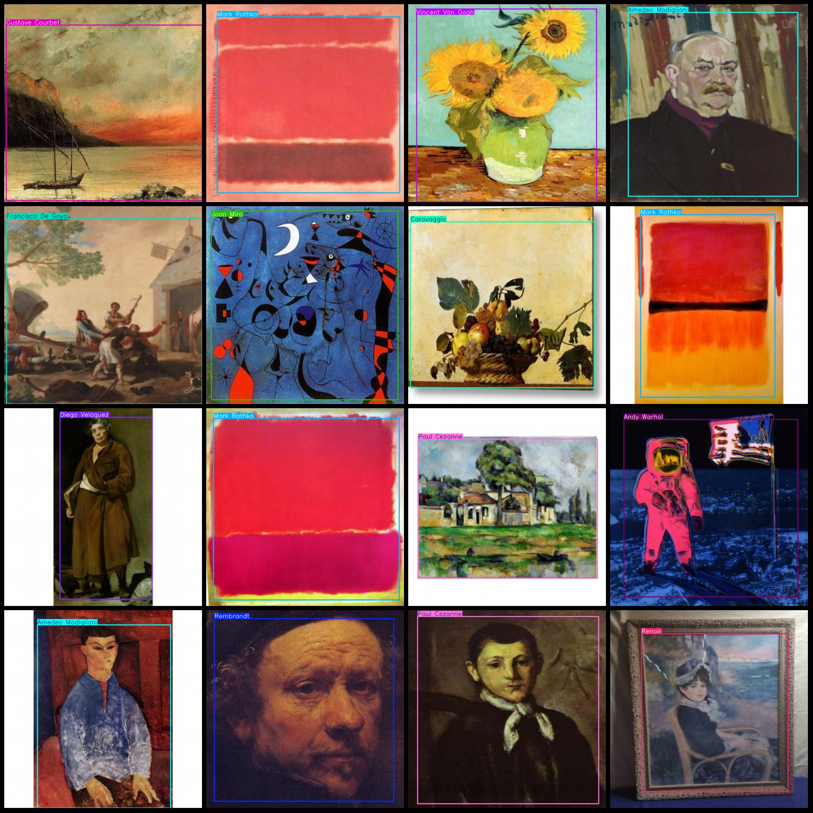

# Western Art Painting Author Identification Dataset in VOC+YOLO format with 3006 images across 34 categories

Dataset format: Pascal VOC format + YOLO format (without split path in txtfile, only containing jpgimage and corresponding VOC format xmlfile and yolo format txtfile)
The number of images (number of jpg files): 3006
The number of XML files is 3006.
The annotations number is 3006.
annotationnumber of classes: 34  
["Amedeo Modigliani", "Andy Warhol", "Arshille Gorky", "Caravaggio", "Claude Monet", "Diego Velaquez", "Edgar Degas", "Edouard Manet", "Edvard Munch"]
"Edward Hopper","Francisco De Goya","Georges Braque","Georges Seurat","Giotto Di Bondone","Gustav Klimt","Gustave Courbet","Henri Matisse","Jackson Pollock","Jan Van Eyck","Joan Miro","Johannes 
Vermeer","Leonardo Da Vinci","Mark Rothko","Pablo Picasso","Paul Cezanne","Paul Gauguin","Paul Klee","Rembrandt","Renoir","Salvador Dali","Sandro Botticelli","Vincent Van Gogh","Wassily Kandisky",
"William Turner"]  
```markdown
total boxes:  3142
image resolution:  640x640
Use annotation tool: labelImg
Annotation rules: Draw a rectangle around the class.
Important notes: The dataset does not have a division into training, validation, and test sets; you need to manually divide it.
Special statement: This dataset does not guarantee any accuracy for the trained model or weight file.
Image preview:




Here is a pay link on Stripe ( https://buy.stripe.com/3cs8yP7sY87d0vu9AB ). Please contact me lonlonago@foxmail.com after funding $89, and I will send you a complete data files , thank you!

